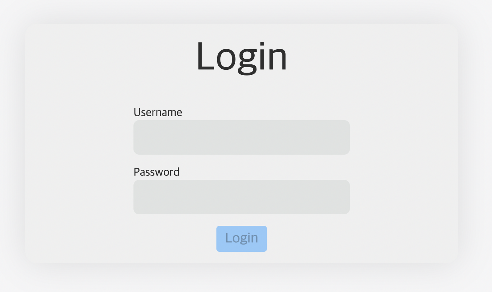
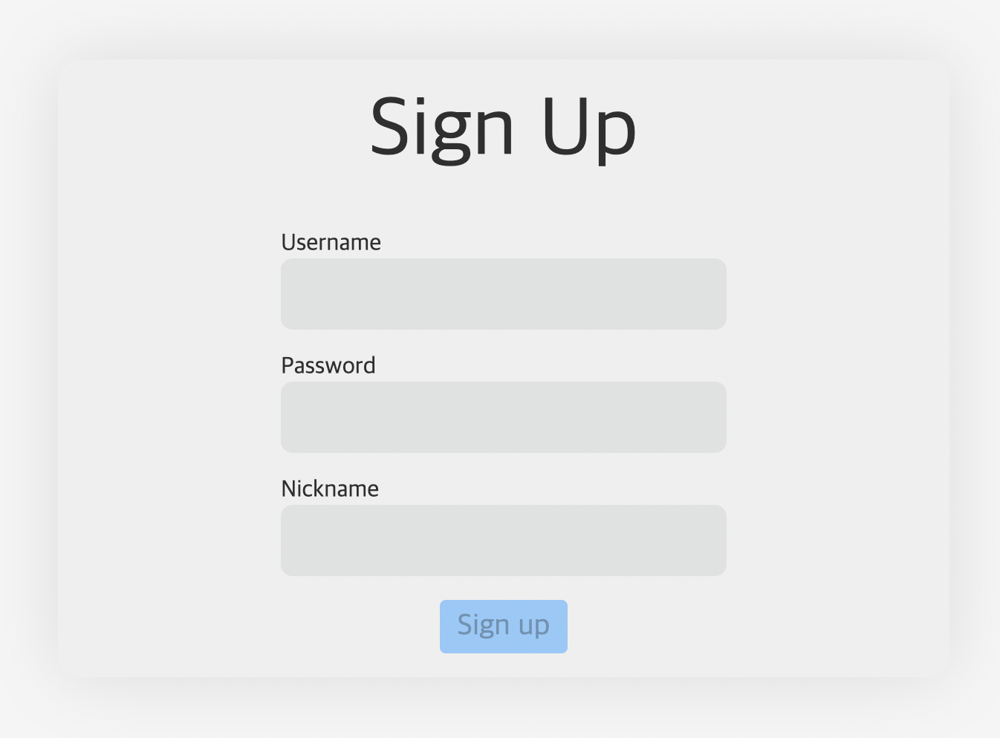
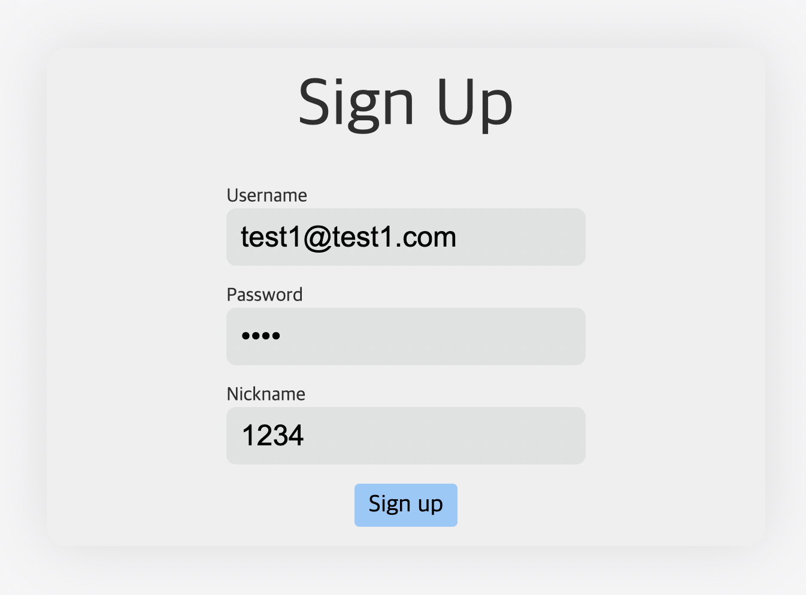
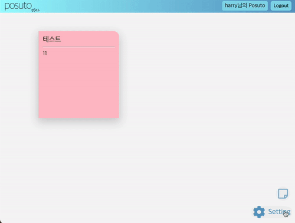

# Posuto(ポスト)
<p align="center">

</p>

*Just post it.* <br/>
배포 : <a href="https://posuto.netlify.app/" target="_blank">https://posuto.netlify.app/</a>

Tech Stack : <br/>


</br>
</br>
</br>

## 🤔 Posuto란?

<br/>

- Posuto는 간단한 할 일 기록, TIL 등을 기록하기 위한 포스트잇 어플리케이션 입니다.
- 사랑하는 아내를 위해 기획되었지만, 많은 사람들이 유용하게 사용 가능하게 오픈소스로 배포합니다.
- 기존 온라인 포스트잇 어플리케이션들은, 복잡한 회원가입 구조를 가지고 있고, 사용자 인스턴스를 생성하는데 시간이 소요되기도 합니다.
이러한 복잡한 과정들을 생략하고, 간단한 회원가입과 함께 즉시 사용 가능한 포스트잇 어플리케이션이 있다면 어떨까? 라는 생각으로 개발했습니다.

</br>
</br>

## 🖱 Posuto UI/UX 살펴보기
</br>
<p align="center">

</p>

+ URL 접속시 최초로 보게 될 화면입니다.
+ 계정이 없을 시, 우측 상단의 Signup 버튼을 누르면 회원가입 페이지로 이동합니다.

</br>
<p align="center">

</p>

+ Username은 이메일 형식으로 작성해야 합니다.

</br>
<p align="center">

</p>

- Form이 비어있지 않고, Form Validation의 조건을 만족하면, Signup 버튼이 활성화 됩니다.

</br>

<p align="center">

<p/>

+ 성공적으로 회원가입을 마쳤다면, 귀여운 모달창이 알려줍니다.

<p align="center">

</p>

+ 우측 하단 포스트 버튼을 클릭시, 새로운 Default 포스트가 생성됩니다.
+ 포스트에 마우스를 올리고 수정 버튼을 활성화하면, 포스트가 수정이 가능한 Form 형태가 됩니다.
+ 수정을 마쳤다면, 다시 수정 버튼을 클릭해 비활성화하면, Drag&Drop/Resize 가능한 포스트잇 됩니다.

</br>

<p align="center">

</p>

+ 우측 하단 설정버튼을 클릭시, 포스트잇 배경색을 선택하는 창이 나옵니다.

</br>
</br>

## 🛠 기술 스택 & 배포 환경

+ 기술스택
    - Vue.js 2
    - Vue Router
    - Vuex
    - Axios
    - Express
    - MongoDB(mongoose)
+ 배포환경
    - Front-end : Netlify
    - Back-end : Heroku

## ⚙️ 개발 환경

+ [Chrome](https://www.google.co.kr/chrome/)
+ [Git](https://git-scm.com/downloads)
+ [VSC](https://code.visualstudio.com/)
+ [node.js](https://nodejs.org/ko/)
+ [Vue Dev Tool](https://chrome.google.com/webstore/detail/vuejs-devtools/nhdogjmejiglipccpnnnanhbledajbpd)

</br>
</br>

## ⛓ 프론트엔드 소스트리

</br>

```
├── src
   ├── App.vue
   ├── api
   │   └── common
   ├── assets
   ├── components
   │   └── common
   ├── css
   ├── views
   ├── mixins
   ├── routes
   ├── store
   ├── utils
   └── main.js ...

```

## ⛓ 백엔드 소스트리

</br>

```
├── src
   ├── api 
   ├── config
   ├── models
   ├── utils
   └── app.js ...
```

